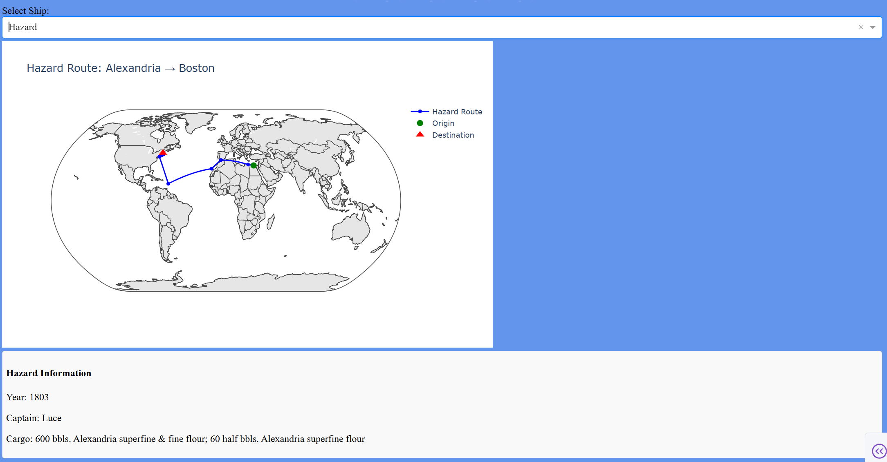

<div align = "center">

</div>

## Quick Start
### Prerequisites

- Python 3.12.x

### Guide
Run the following lines into your system's command prompt:
1. Clone the Repository:
```bash
git clone https://github.com/cayceee/Historical_Ship_Routes.git
```
2. Set as current Directory:
```bash
cd Historical_Ship_Routes
```
3. Install uv if not already installed:
```bash
pip install uv
```
4. Sync uv:
```bash
python -m uv sync
```
5. Run main.py:
```bash
python -m uv run main.py
```
## Description
<div align = "center">

</div>

- project detail 1
- project detail 2
